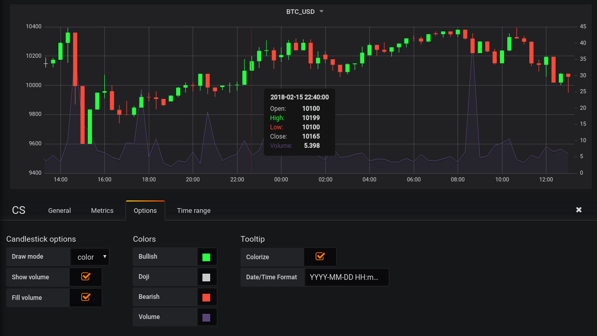
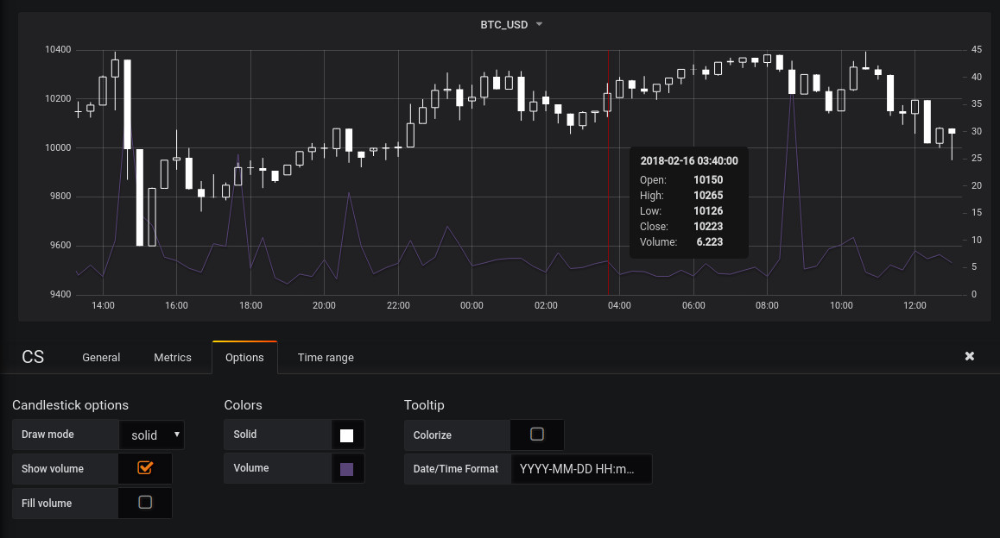
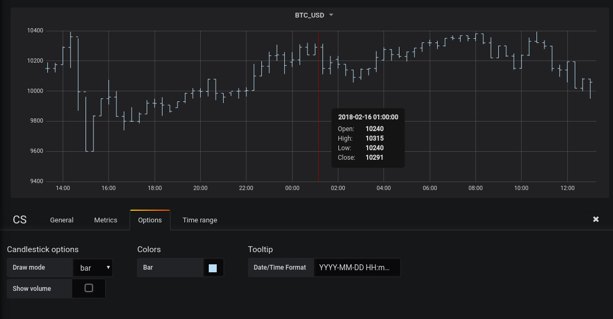
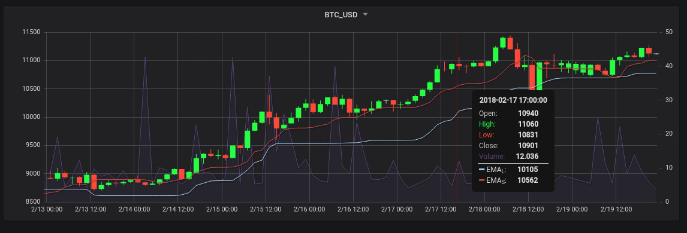

# Grafana Candlestick Panel

### Install

[Official Grafana Plugins install instruction](http://docs.grafana.org/plugins/installation/#installing-plugins-manually)

### Usage

Four basic metrics should have aliases: *open*, *close*, *high*, *low*. The trade volume metric has alias *volume*. All other metrics are taken by indicators.

Work tested on Influx data source.

Examples of query on InfluxDB data source:

**open**: `SELECT first("open") FROM "ticker" WHERE ("market" =~ /^$market$/ AND "pair" =~ /^$pair$/) AND $timeFilter GROUP BY time($__interval) fill(linear)`

**close**: `SELECT last("close") FROM "ticker" WHERE ("market" =~ /^$market$/ AND "pair" =~ /^$pair$/) AND $timeFilter GROUP BY time($__interval) fill(linear)`

**low**: `SELECT min("low") FROM "ticker" WHERE ("market" =~ /^$market$/ AND "pair" =~ /^$pair$/) AND $timeFilter GROUP BY time($__interval) fill(linear)`

**high**: `SELECT max("high") FROM "ticker" WHERE ("market" =~ /^$market$/ AND "pair" =~ /^$pair$/) AND $timeFilter GROUP BY time($__interval) fill(linear)`

**volume**: `SELECT max("volume") FROM "ticker" WHERE ("market" =~ /^$market$/ AND "pair" =~ /^$pair$/) AND $timeFilter GROUP BY time($__interval) fill(linear)`

### Screenshots

Main view with plugin options:

Solid view:

Bar view:

Chart with indicators:

#### Changelog

##### v0.0.1

- First working version
